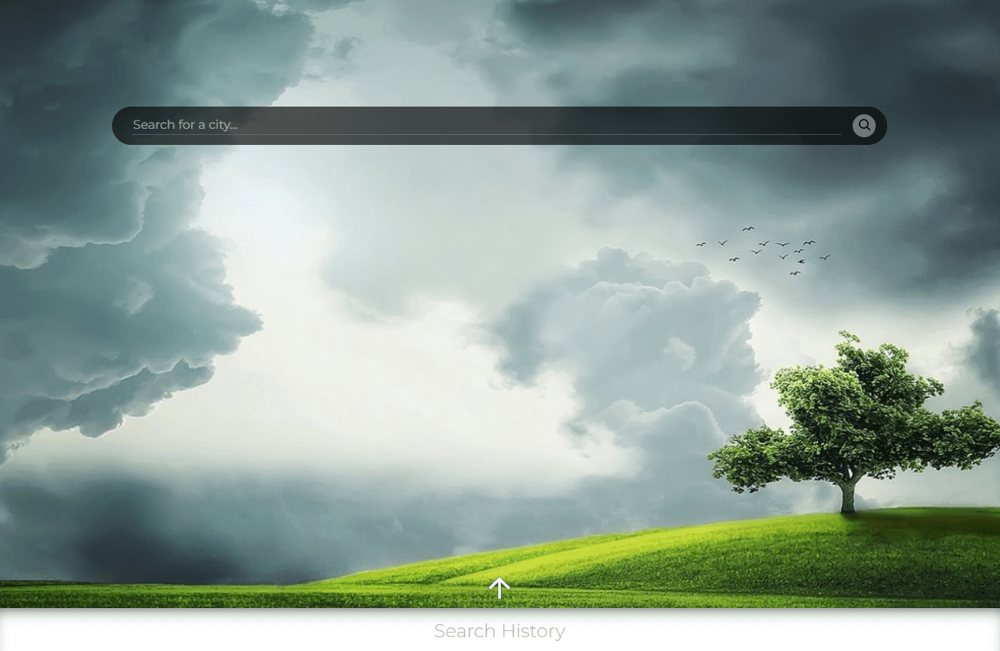
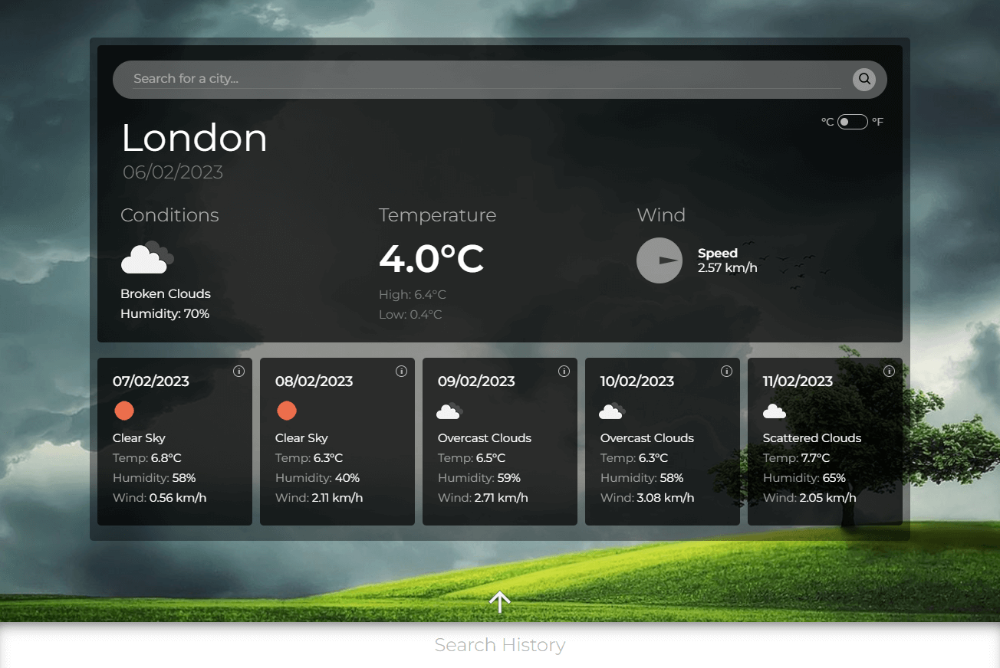
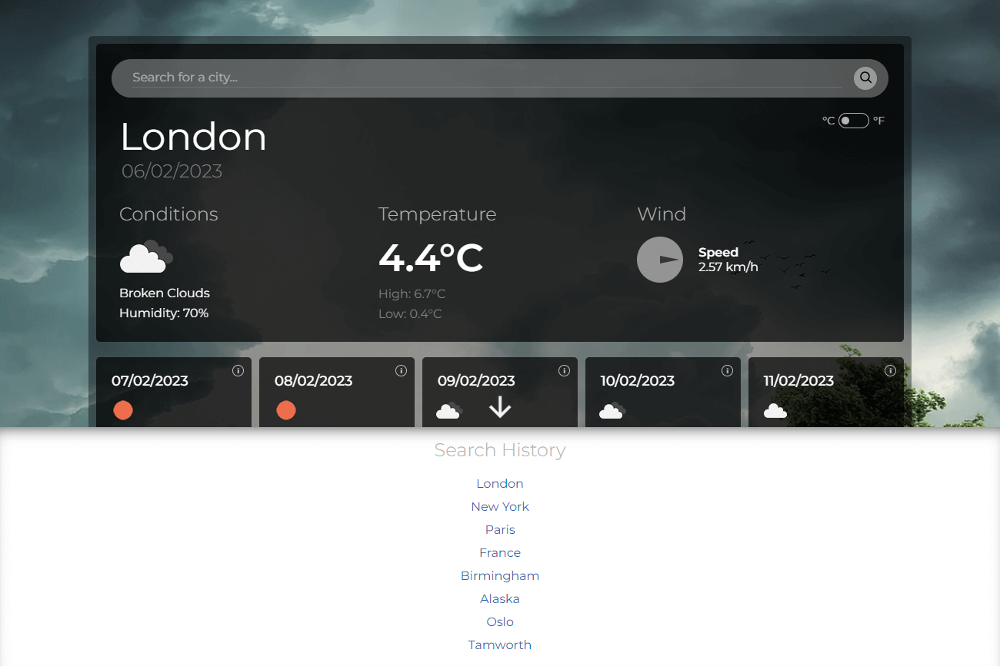

# Server-Side APIs: Weather Dashboard

## Description

I was given a task to build a weather dashboard that will run in the browser and feature dynamically updated HTML and CSS.

### User Story

```text
AS A traveler
I WANT to see the weather outlook for multiple cities
SO THAT I can plan a trip accordingly
```

### Acceptance Criteria

* Create a weather dashboard with form inputs.
  * When a user searches for a city they are presented with current and future conditions for that city and that city is added to the search history
  * When a user views the current weather conditions for that city they are presented with:
    * The city name
    * The date
    * An icon representation of weather conditions
    * The temperature
    * The humidity
    * The wind speed
  * When a user view future weather conditions for that city they are presented with a 5-day forecast that displays:
    * The date
    * An icon representation of weather conditions
    * The temperature
    * The humidity
  * When a user click on a city in the search history they are again presented with current and future conditions for that city

The application will be complete when it satisfies all of the above acceptance criteria plus the following:
  * Uses the OpenWeather API to retrieve weather data.
  * Uses `localStorage` to store persistent data.

## Table of contents
- [Installation](#installation)
- [Usage](#usage)
- [Credits](#credits)
- [License](#license)

## Installation

N/A

## Usage
- [Deployed Application](https://trunten.github.io/ubbc-weather-dashboard/)
- JavaScript is required for the site to function.
- Search for the weather in a city by entering the city name in the search field.
  - Hit enter or click on the spy glass button to retrieve weather information.
- Toggle temperature units between celcius and fahrenheit by clicking on the unit toggle button in the top right corner of the main weather detail section of the app.
- Access previous searches by clicking on the up arrow at the bottom of the page. 
  - Weather information for these cities can be fetched again by clicking on the relevant link in the history pane.
- View more detailed information for any of the 5 future forecast days by clicking the "i" symbol in the top right of the future forecast cards.
  - Revert the main display back to today's weather information by clickin the back arrow next to the date (only appears if viewing a day in the future).
- **Application note:** Dates & times are local to the searched location. eg. Searching for a location that is in a timezone where it is already today or still yesterday then the reported dates will reflect this fact.


Application screenshots:
 [](https://trunten.github.io/ubbc-weather-dashboard/)

 [](https://trunten.github.io/ubbc-weather-dashboard/)

 [](https://trunten.github.io/ubbc-weather-dashboard/)

## Credits
- Background images: [Unsplash.com](https://unsplash.com/)
- Favicon: https://icons8.com/
- Clip-path for compass needle: https://usefulangle.com/post/333/css-triangle
- Wait for image load before switching source: https://stackoverflow.com/questions/2342132/waiting-for-image-to-load-in-javascript

## License
Please refer to the [LICENSE (MIT)](LICENSE) in the repo.


